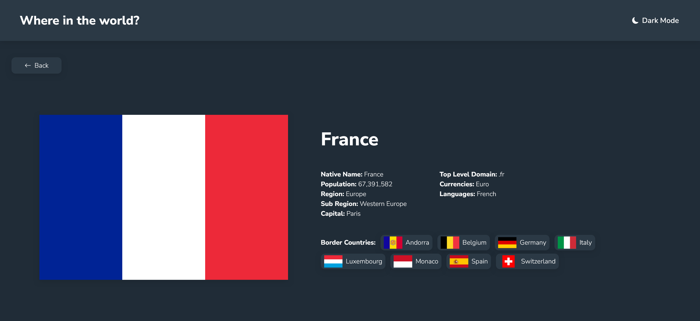

# Frontend Mentor - REST Countries API with color theme switcher solution

## Live Page Link : [https://country-info-sriveer.netlify.app/](https://country-info-sriveer.netlify.app/) 

This is a solution to the [REST Countries API with color theme switcher challenge on Frontend Mentor](https://www.frontendmentor.io/challenges/rest-countries-api-with-color-theme-switcher-5cacc469fec04111f7b848ca). Frontend Mentor challenges help you improve your coding skills by building realistic projects. 

## Table of contents

- [Overview](#overview)
  - [The challenge](#the-challenge)
  - [Screenshot](#screenshot)
  - [Links](#links)
- [Author](#author)

## Overview

This project was built using react, react router and scss. this was my first real project using react router and I got a feel for how things work.

### The challenge

Users should be able to:

- See all countries from the API on the homepage
- Search for a country using an `input` field
- Filter countries by region
- Click on a country to see more detailed information on a separate page
- Click through to the border countries on the detail page
- Toggle the color scheme between light and dark mode

### Screenshot

#### Mobile

#### Desktop

### Links

- Solution URL: [https://github.com/veeru-neerukonda/country-info.git](https://github.com/veeru-neerukonda/country-info.git)
- Live Site URL: [https://country-info-sriveer.netlify.app/](https://country-info-sriveer.netlify.app/)

## Author

- Website - [https://veeru-portfolio.netlify.app/](https://veeru-portfolio.netlify.app/)